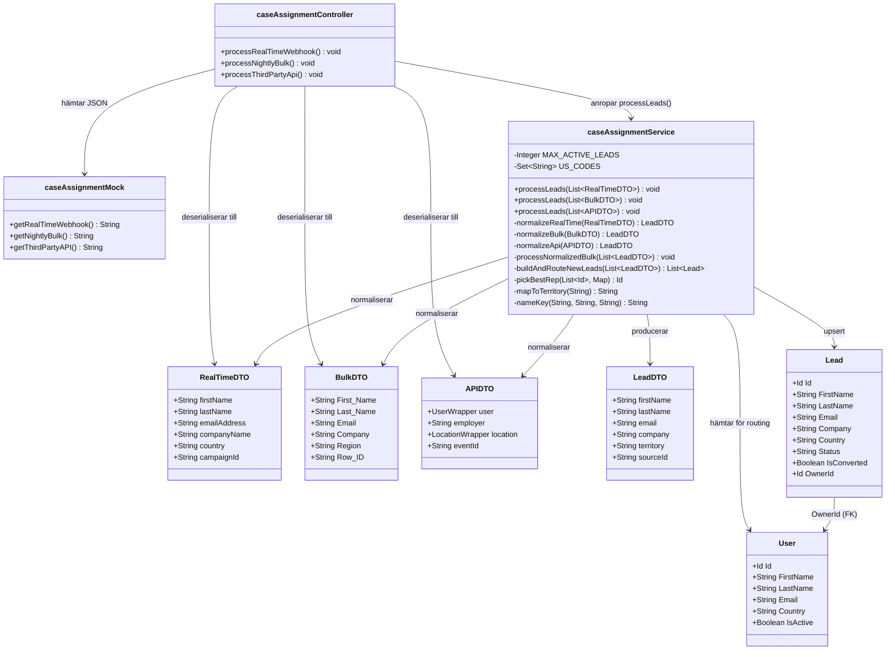

# UML Class Diagram — Lead Routing & Integration Hub

## Förklaring av notation

| Symbol | Betydelse |
|--------|-----------|
| `+` | public |
| `-` | private |
| `-->` | beroende / anropar |
| `~Type~` | generisk typ, t.ex. `List<String>` |
