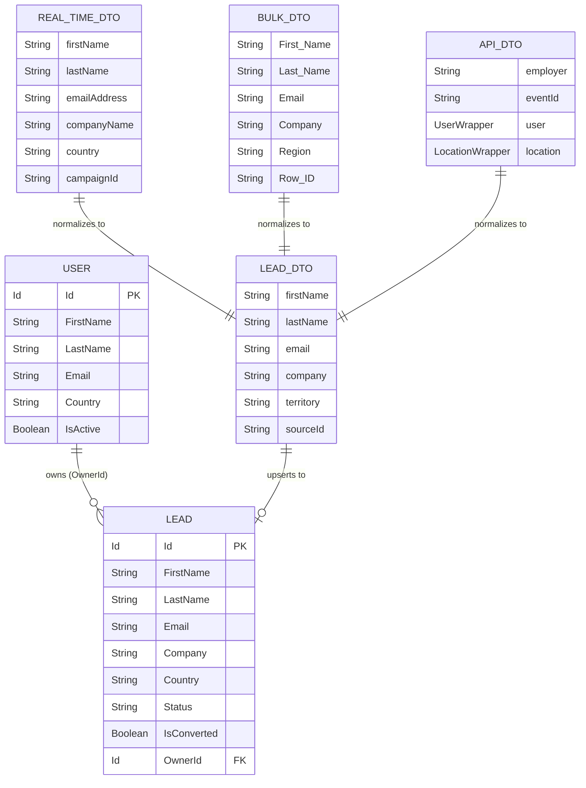

# Entity Relationship Diagram — Lead Routing & Integration Hub

## Notes

| Fält | Förklaring |
|------|-----------|
| `Lead.Country` | Lagrar territorium ('US' eller 'EU') — normaliserat från källans landskod |
| `Lead.OwnerId` | FK till User — sätts av routing-motorn baserat på territorium och kapacitet |
| `User.Country` | Används som territoriummarkör ('US' eller 'EU') — i produktion ersätts detta av ett dedikerat `Territory__c` custom field |
| `Lead.IsConverted` | Salesforce standard-fält — används för att filtrera bort konverterade leads vid deduplicering och kapacitetsräkning |
| `LeadDTO` | Inte ett databasentitet — en in-memory representation som existerar enbart under normalisering |
